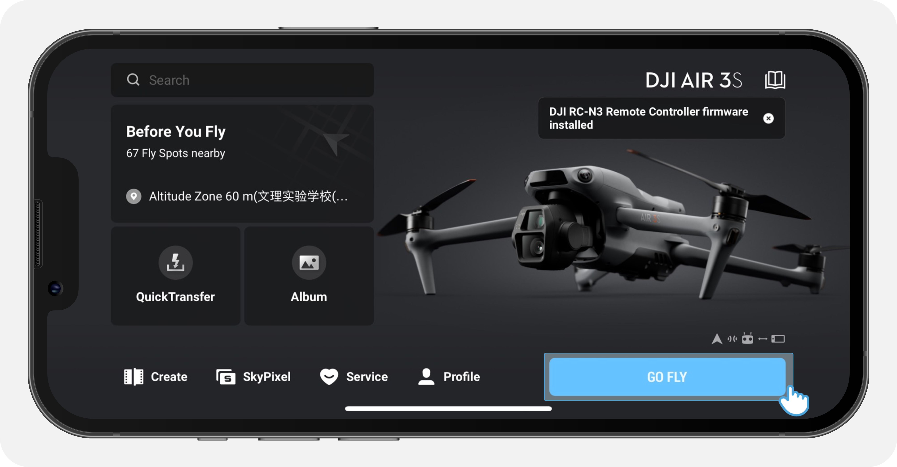
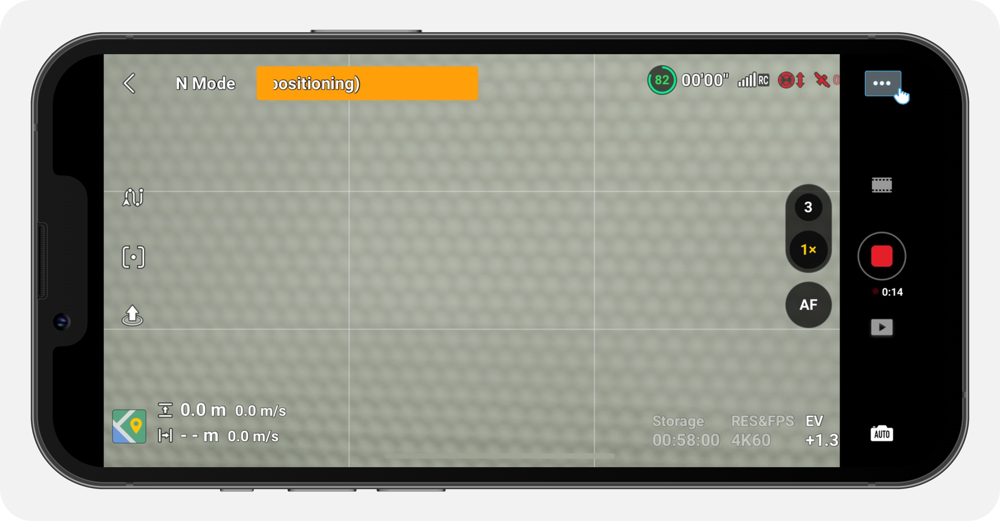
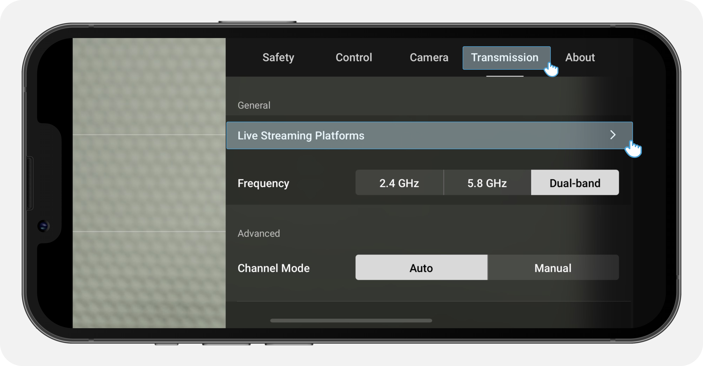
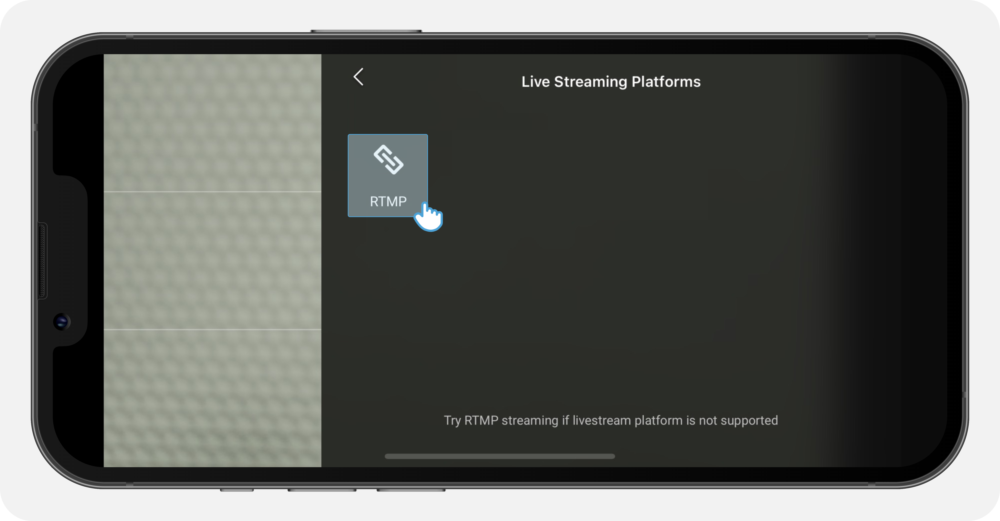
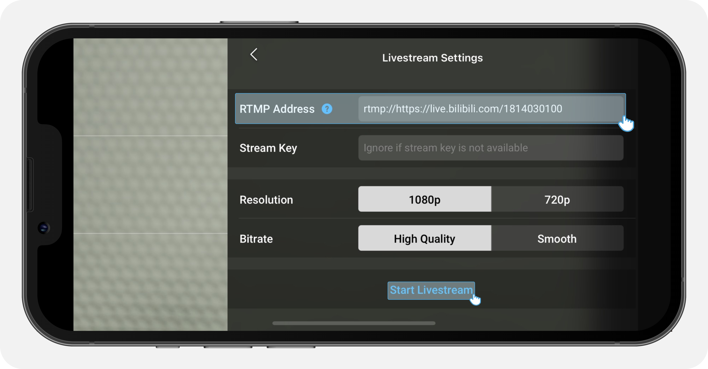
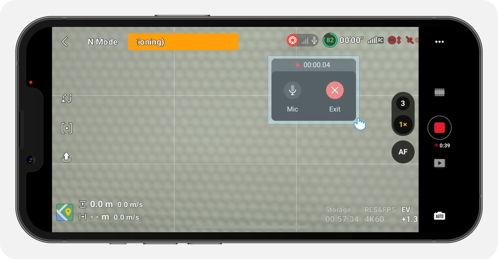

# Руководство по использованию приложения DJI Fly для прямых трансляций

Это руководство поможет вам разобраться: 

    - какие платформы прямой трансляции поддерживает приложение DJI Fly, 
    - как вести прямую трансляцию, 
    - какие продукты поддерживают прямую трансляцию, 
    - какие дополнительные разрешения и скорости передачи видео можно использовать.

**Соответствующие продукты:** дроны с камерой

Прямую трансляцию поддерживает приложение DJI Fly версии V1.4.12 и выше. Чтобы использовать эту возможность и делиться изображением с экрана, вам нужно включить потоковую трансляцию в **Настройках передачи изображения** / **Image Transmission Settings**.

> 1. Если для прямой трансляции вы используете приложение DJI Fly версии V1.16.0 и выше с пультами DJI RC 2/DJI RC Pro/DJI Smart Controller, то перед началом работы необходимо подключить микрофон.
> 
> 2. Пульт дистанционного управления DJI RC не поддерживает трансляцию в реальном режиме времени.
> 
> 3. Прямая трансляция по протоколу RTMP поддерживается, если вы используете дроны DJI Mavic 4 Pro, DJI Flip, DJI Air 3S, DJI Air 3 или DJI Mini 4 Pro вместе с пультом DJI RC 2.
> 
> 4. Если с пультами DJI RC-N3/DJI RC-N2/DJI RC-N1 используются другие модели дронов, то в таком случае поддерживается трансляция по протоколу RTMP.

## Дополнительные разрешения и скорости передачи видео

**Дополнительное разрешение:** 1080P или 720P

> Из-за аппаратных ограничений пульт DJI RC 2 поддерживает трансляцию в реальном режиме времени только в формате 720P.

**Дополнительные скорости передачи видео:** 
    
    - устройства на iOS: 2 Мбит/сек или 1 Мбит/сек; 
    - устройства на Android: 5 Мбит/сек или 3 Мбит/сек.

**Поддерживаемые платформы:**

    RTMP

**Руководство по проведению прямой трансляции по протоколу RTMP**

**Перед началом работы:**

1. Загрузите и установите приложение [DJI Fly](https://www.dji.com/downloads/djiapp/dji-fly).

2. Убедитесь, что приложение подключено к интернету через 4G/5G или Wi-Fi.

3. Подтвердите, что у аккаунта есть разрешение на прямую трансляцию на соответствующей платформе. Если этого разрешения нет, то получить коды для трансляции нельзя и провести ее по протоколу RTMP невозможно.

4. Убедитесь, что текущая платформа поддерживает протоколы RTMP. Изучите руководства по прямой трансляции или свяжитесь со службой поддержки клиентов платформы.

**После подготовки выполните следующие действия:**

1. Включите питание дрона и пульта управления, подклюaчите пульт к приложению DJI Fly. Если подключение выполнено успешно, то на экране появится сообщение **GO FLY**.

Примечание: При подключении пульта управления к приложению DJI Fly используйте USB-кабель для подключения к дрону. Это не нужно делать в том случае, если вы используете пульт дистанционного управления со встроенным экраном, например, DJI RC Pro и DJI Smart Controller.

2. Нажмите GO FLY > Transmission > Live Streaming Platforms > RTMP.

3. Введите адрес прямой трансляции и коды, полученные от платформы в поле **RTMP Address**. Чтобы получить дополнительную информацию об этом, изучите руководство по прямой трансляции или свяжитесь со службой поддержки клиентов платформы.

Ниже показан скриншот с платформы Bilibili для получения протокола RTMP:

> **Внимание!**
> 
> Между адресом и кодами прямой трансляции добавьте «/» в качестве перехода. Если адрес прямой трансляции уже заканчивается на «/», то добавлять еще один слеш не нужно. Например, адрес прямой трансляции: rtmp://10.39.12.189:1935, а код прямой трансляции: livxxxme. Получаем: rtmp://10.39.12.189:1935/livxxxme.

4. После заполнения полей **RTMP Address**, **Livestream Resolution** и **Livestream Bitrate** нажмите **Start**. На экране появится обратный отсчет **3/2/1**. После завершения обратного отсчета автоматически запустится прямая трансляция. Если подключение к платформе для прямых трансляций было успешным, то на экране, куда будет выводится вид с камеры, появится красная иконка.

